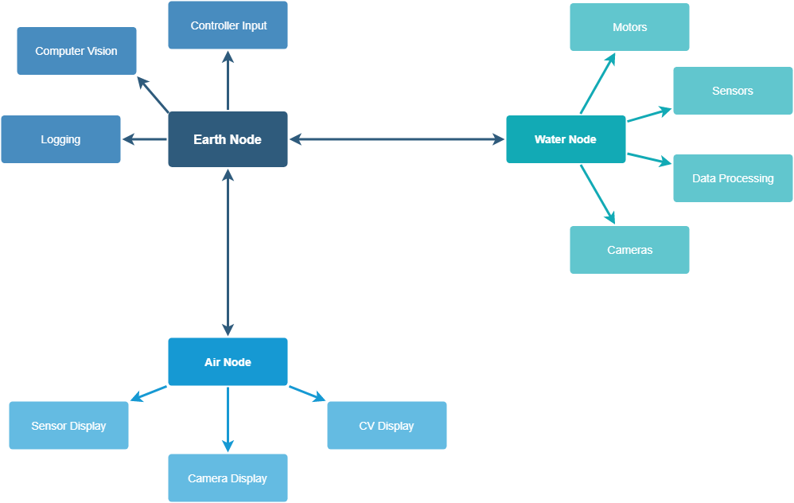

# **MATE Robot Controller**

# Setup

Download and install anaconda for your system based on [these](https://docs.conda.io/projects/conda/en/latest/user-guide/install/) instructions.

`cd` into the root directory of this repo and create a new anaconda environment with the command `conda env create -f robotControllerEnvironment.yml`. This creates a new environment called `robot-controller` that automatically installs all of the necessary libraries.

Activate the environment with `conda activate robot-controller`.

To use the Arduino, you will need to download either the Arduino IDE or setup the web IDE. The Odoo Bolt has an integrated Arduino Leonardo.

# Usage

## Overview

This code is split up into **3** sections called *nodes*. The three nodes are `water`, `air`, and `earth`. They are split across two computers. The `air` and `earth` nodes are on the computer above the water in the control station. The `water` node runs on the computer under the water that is attached to the robot.

Each node has a different job in helping the robot function.

The `earth` node is the hub that everything goes through. It communicates with both the `water` and `air` nodes, ensuring that data goes to the right place. As it is the most (computationally) powerful, it also runs all of the computer vision, handles controller input, and is in charge of logging.

The `water` node interfaces with all of the hardware on the robot itself. That includes directly controlling the motors, reading data from sensors, and streaming camera data. Some of the sensor data needs to be pre-processed which it handles too. It sends all of its processed data to the `earth` node.

The `air` node is a front end to display the information captured and processed by the `water` and `earth` nodes. It displays sensor measurments, camera feeds, logs, and computer vision results.

## How to start on Udoo
After connecting the Udoo to the Pi, start two terminal instances on the Udoo. First, run start-earthnode.sh. In the other instance, run start-waternode.sh. This will open an ssh connection to the Pi (so long as you have setup keygens) and start the waternode.
